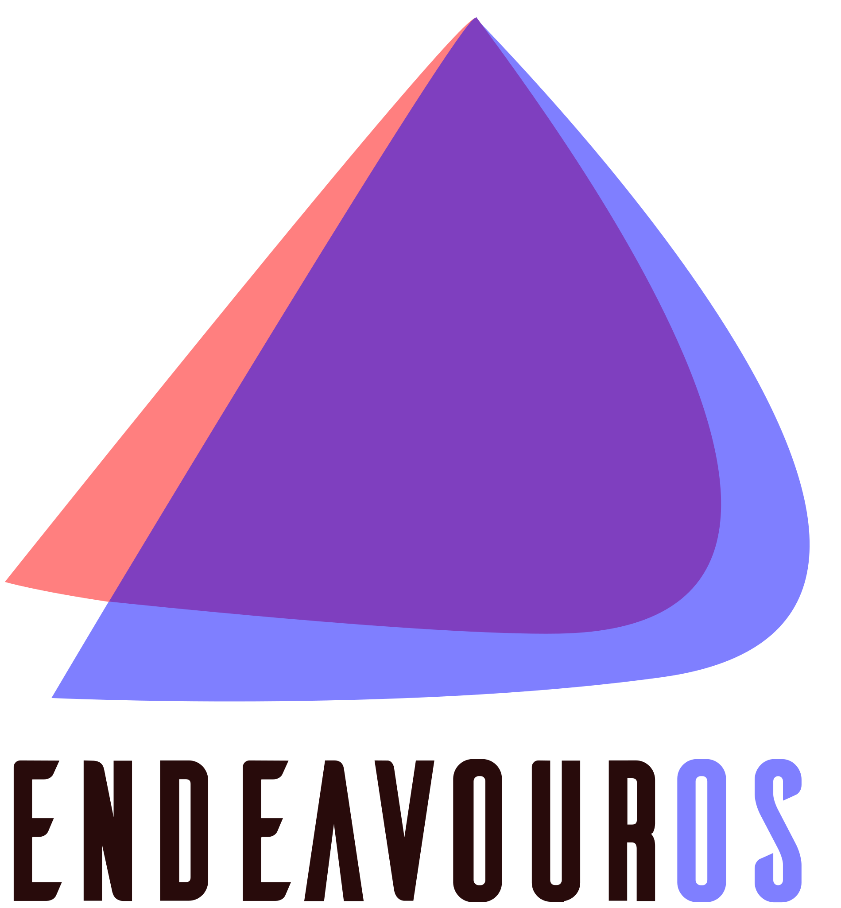

# Oi, eu sou Felipe 👋

## Linguagens de programação

**Eu sei / usando**  
Por enquanto, não sou expert nem especialista em nada 😞

**Aprendendo**

  
  </a>
  
  
  

---

## Ferramentas

**Eu sei / usando**

  
  
  
  
  
  

**Aprendendo**

  
  
   
  
 

---

## Sobre mim

Estou estudando (e sobrevivendo) na escola técnica do **SENAI**.  

Passo mais tempo no `nano ~/.config/hypr/` do que realmente produzindo código.😅  

**Amo demais fazer ricing** no **EndeavourOS + Hyprland** – ficar deixando tudo bonito é meio viciante.

Sempre aprendendo, sempre melhorando. ⭐
